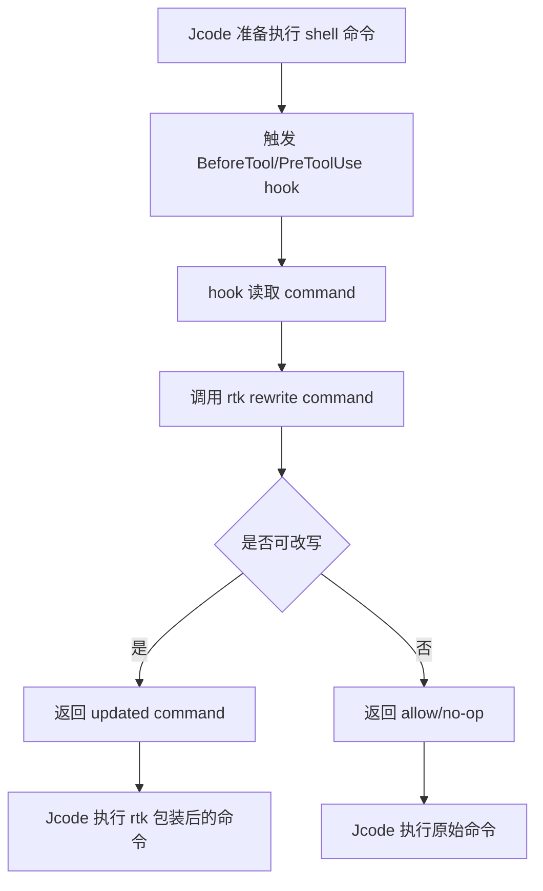

# RTK 支持 Jcode 所需能力分析

## 背景

RTK 的 agent 集成目标是：当编码 agent 准备执行命令时，自动把高噪声命令改写成 RTK 包装命令，例如把：

```bash
git status
```

改写为：

```bash
rtk git status
```

这样 agent 看到的是经过 RTK 压缩、过滤或摘要后的输出，从而减少上下文 token 消耗。

现有 RTK 设计中，核心命令改写逻辑已经集中在 `rtk rewrite`。因此，Jcode 不需要内置 RTK 的过滤逻辑，只需要在合适的时机把即将执行的命令交给 RTK 判断，并接受 RTK 返回的新命令。

本文档分析：如果要让 RTK 扩展支持 Jcode，Jcode 需要具备哪些能力。

## 结论

支持 Jcode 是可行的。最佳集成方式是让 Jcode 提供一个“命令执行前 hook”，允许外部程序读取并修改即将执行的 shell 命令。

最低可用能力是规则/提示注入，最佳能力是透明命令改写。

### 当前 Jcode 源码对照结论

基于当前 Jcode 源码分析，Jcode **已经具备 Level 1 提示/规则级集成条件**，但**尚不具备 Level 2 透明命令改写 hook 条件**。

当前可直接利用的能力：

- Jcode 有稳定的全局配置目录和配置文件：`~/.jcode/config.toml`，也可通过 `$JCODE_HOME/config.toml` 覆盖。
- Jcode 会读取项目级 `AGENTS.md` 和全局 `~/.AGENTS.md`，可用于写入 RTK 使用提示。
- Jcode 会读取项目级 `.jcode/prompt-overlay.md` 和全局 `~/.jcode/prompt-overlay.md`，同样可用于写入 RTK 使用提示。
- Jcode 的 shell 工具内部名是 `bash`，兼容别名 `shell_exec`，命令字段是 `command`。
- Windows 下 `bash` 工具实际通过 `cmd.exe /C <command>` 执行，非 Windows 下通过 `bash -c <command>` 执行。

当前缺失的关键能力：

- 工具执行前没有通用 `BeforeToolCall` / `PreToolUse` hook。
- `~/.jcode/config.toml` 的配置 schema 里目前没有 hooks 字段。
- 工具执行入口会直接调用 tool，当前没有外部程序修改 `tool_input` 的机制。
- 没有 `updated_input.command` 替换原命令的流程。
- 没有 hook timeout、fail open、stdout JSON 协议、stderr 调试日志等 hook 运行时能力。

因此，RTK 侧当前可以先实现：

1. `rtk init --agent jcode` 写入 `AGENTS.md` 或 `.jcode/prompt-overlay.md` 的提示级集成。
2. 等 Jcode 增加 before-tool hook 后，再实现 `rtk hook jcode` 和透明改写集成。

如果要在 Jcode 侧实现透明 hook，推荐优先改造 `src/tool/mod.rs` 的 `Registry::execute`，在调用具体 tool 前运行 hook，并对 `bash` / `shell_exec` 的 `command` 字段应用 `updated_input.command`。

推荐优先级：

1. **必须能力**：命令执行前 hook。
2. **必须能力**：hook 能读取命令字符串。
3. **必须能力**：hook 能返回修改后的命令。
4. **重要能力**：hook 失败时 fail open，不阻塞原始命令。
5. **重要能力**：支持全局和项目级配置。
6. **增强能力**：支持权限决策、审计日志、dry-run 调试。

## 集成层级

### Level 1：提示/规则级支持

这是最低成本方案。Jcode 提供一个类似 `JCODE.md`、`AGENTS.md`、`.jcoderules` 的规则文件，让 RTK 安装一段提示：

> 执行 shell 命令时，优先使用 `rtk <command>`，例如使用 `rtk cargo test` 而不是 `cargo test`。

#### Jcode 需要具备的功能

- 支持读取项目级或用户级规则文件。
- 规则内容能影响 agent 的命令生成行为。
- 规则文件位置稳定、可文档化。

#### 优点

- 实现成本最低。
- 不需要修改 Jcode 执行管线。
- 类似 RTK 当前对 Codex、Cline、Windsurf、Kilo Code、Antigravity 的支持方式。

#### 缺点

- 不保证 agent 一定遵守。
- 无法拦截用户或模型生成的所有命令。
- 无法做强制透明改写。

#### 适合阶段

适合作为第一阶段快速支持。

### 当前 Jcode 可用的规则文件位置

当前 Jcode 已经支持以下 prompt/rules 注入位置，RTK 可以优先使用这些位置实现 `rtk init --agent jcode`：

| 位置 | 级别 | Jcode 源码依据 | 建议用途 |
| --- | --- | --- | --- |
| `AGENTS.md` | 项目级 | `src/prompt.rs::load_agents_md_files_from_dir` | 推荐作为项目级 RTK 提示安装位置 |
| `~/.AGENTS.md` | 用户级 | `src/prompt.rs::load_agents_md_files_from_dir` | 可作为全局提示安装位置 |
| `.jcode/prompt-overlay.md` | 项目级 | `src/prompt.rs::load_prompt_overlay_files_from_dir` | 推荐作为 Jcode 专属项目级提示安装位置 |
| `~/.jcode/prompt-overlay.md` | 用户级 | `src/prompt.rs::load_prompt_overlay_files_from_dir` | 推荐作为 Jcode 专属全局提示安装位置 |
| `~/.jcode/config.toml` | 用户级配置 | `src/config.rs`、`src/config/config_file.rs` | 当前可检测存在，但尚不能注册 hooks |

建议 RTK 第一阶段优先写入 `.jcode/prompt-overlay.md`，原因是它是 Jcode 专属位置，不容易影响其他 agent；如果用户希望多 agent 共享规则，再写入 `AGENTS.md`。

推荐写入内容示例：

```markdown
# RTK Integration

执行 shell/bash 命令时，优先使用 RTK 包装命令，例如：

- 使用 `rtk git status`，不要直接使用 `git status`。
- 使用 `rtk cargo test`，不要直接使用 `cargo test`。
- 使用 `rtk npm install`，不要直接使用 `npm install`。

如果命令已经以 `rtk` 开头，不要重复添加 `rtk`。
```

RTK 的 `--show` 或检测逻辑可以检查：

- `.jcode/prompt-overlay.md` 是否包含 RTK 标记段。
- `~/.jcode/prompt-overlay.md` 是否包含 RTK 标记段。
- `rtk` 是否在 `PATH` 中。
- `rtk rewrite "git status"` 是否返回可用结果。

## Level 2：透明命令改写 hook

这是推荐方案。Jcode 在执行 shell 命令前触发 hook，把 tool call 信息传给外部命令。RTK hook 从 JSON 中提取命令，调用 `rtk rewrite`，如果得到更优命令，则返回给 Jcode 替换原命令。

### 推荐流程



### Jcode 需要具备的功能

#### 1. 命令执行前 hook

Jcode 需要在 shell/bash/terminal 工具执行前提供一个 hook 点，例如：

- `PreToolUse`
- `BeforeToolCall`
- `BeforeCommandExecute`
- `tool.execute.before`

这个 hook 应该在命令真正执行前触发。

#### 2. 标准输入传递 JSON payload

Jcode 应该把 tool call 信息通过 stdin 或等价机制传给 hook。

推荐 payload：

```json
{
  "hook_event_name": "BeforeToolCall",
  "tool_name": "shell",
  "tool_input": {
    "command": "git status",
    "cwd": "/path/to/project"
  },
  "session_id": "optional-session-id",
  "request_id": "optional-request-id"
}
```

最关键字段是：

```json
{
  "tool_input": {
    "command": "..."
  }
}
```

#### 3. 支持 hook 返回 updated input

Jcode 需要允许 hook 修改即将执行的命令。

推荐返回格式：

```json
{
  "decision": "allow",
  "updated_input": {
    "command": "rtk git status"
  },
  "reason": "RTK auto-rewrite"
}
```

或者兼容 Claude 风格：

```json
{
  "hookSpecificOutput": {
    "hookEventName": "BeforeToolCall",
    "permissionDecision": "allow",
    "permissionDecisionReason": "RTK auto-rewrite",
    "updatedInput": {
      "command": "rtk git status"
    }
  }
}
```

建议 Jcode 选择简单稳定的格式：`decision + updated_input`。

#### 4. no-op 返回

当命令不需要改写时，hook 应该能返回 no-op。

推荐：

```json
{
  "decision": "allow"
}
```

或者空输出也可表示 no-op，但 JSON 更容易调试。

#### 5. fail open 语义

Jcode 必须保证 hook 异常不会阻塞命令执行。

以下情况应当执行原始命令：

- hook 程序不存在。
- hook 超时。
- hook 输出非法 JSON。
- hook 返回非零退出码。
- RTK 不在 PATH 中。
- `rtk rewrite` 内部失败。

推荐默认策略：

> hook 失败 = 记录 warning = 执行原始命令。

这与 RTK 当前 hook 设计一致，可以避免用户工作流被破坏。

#### 6. hook 超时

Jcode 应支持 hook 超时配置，避免外部程序卡住命令执行。

推荐默认值：

- 1 到 2 秒。

RTK rewrite 通常很快，超过该时间可视为异常并 fail open。

#### 7. 支持按工具匹配

Jcode hook 应该能只作用于 shell/terminal/bash 工具，而不是所有工具。

推荐配置：

```json
{
  "hooks": {
    "BeforeToolCall": [
      {
        "matcher": "shell",
        "command": "rtk hook jcode"
      }
    ]
  }
}
```

或者：

```json
{
  "hooks": {
    "before_tool_call": [
      {
        "tools": ["shell", "bash", "terminal"],
        "command": "rtk hook jcode"
      }
    ]
  }
}
```

#### 8. 支持配置文件安装

为了让 RTK 可以实现 `rtk init --agent jcode`，Jcode 需要有稳定的配置路径。

推荐之一：

- 用户级：`~/.jcode/settings.json`
- 项目级：`.jcode/settings.json`
- 规则文件：`JCODE.md` 或 `.jcoderules`

RTK 安装器需要知道：

- 配置目录在哪里。
- hook 配置 schema 是什么。
- 是否需要重启 Jcode。
- 如何检测已安装。
- 如何卸载。

#### 9. 支持环境变量传递

Jcode 执行 hook 时应继承合理环境变量：

- `PATH`
- `HOME`
- `PWD`
- 项目工作目录相关变量

这样 hook 才能找到 `rtk` 二进制，并能读取用户配置。

可选增强：

```bash
JCODE_SESSION_ID
JCODE_PROJECT_DIR
JCODE_TOOL_NAME
```

#### 10. 支持 cwd 字段

建议 payload 中包含当前工作目录：

```json
{
  "tool_input": {
    "command": "cargo test",
    "cwd": "/repo"
  }
}
```

RTK 当前 `rewrite` 主要基于命令字符串，但 cwd 对未来扩展很有用，例如：

- 项目级过滤规则。
- 审计日志定位。
- 多 workspace 支持。

## Level 3：权限与安全能力

透明改写不仅是字符串替换，还涉及命令执行安全。Jcode 如果支持权限决策，会更适合与 RTK 深度集成。

### 推荐 decision 类型

```json
{
  "decision": "allow | ask | deny",
  "updated_input": {
    "command": "rtk git status"
  },
  "reason": "..."
}
```

含义：

- `allow`：允许执行。
- `ask`：允许改写，但仍提示用户确认。
- `deny`：阻止执行。

RTK 当前对 Claude/Copilot 等已经有权限模型概念：

```text
Deny > Ask > Allow > Default
```

如果 Jcode 支持 `ask`，RTK 可以做到：

- 安全命令自动允许。
- 风险命令保持用户确认。
- 被 deny 规则命中的命令不由 RTK 绕过。

### 安全原则

Jcode 应避免让 hook 绕过原本的权限系统。

建议顺序：

1. Jcode 接收模型 tool call。
2. 触发 before hook，允许修改命令。
3. Jcode 对最终命令执行权限检查。
4. 用户确认后执行。

也可以：

1. Jcode 做基础 deny 检查。
2. RTK hook 改写命令。
3. Jcode 对改写后的命令再次检查。

重点是：**改写后的命令也必须经过 Jcode 权限系统**。

## Level 4：插件机制

如果 Jcode 不想直接支持外部命令 hook，也可以提供插件 API。

### Jcode 需要具备的插件能力

- 插件可以监听 tool execution before event。
- 插件可以读取 tool name 和 args。
- 插件可以修改 args。
- 插件可以异步调用外部进程。
- 插件失败时不影响原命令。

TypeScript 风格示例：

```ts
export default function plugin() {
  return {
    name: "rtk-rewrite",
    hooks: {
      "tool.execute.before": async ({ tool, args }) => {
        if (tool !== "shell") return;
        if (typeof args.command !== "string") return;

        const rewritten = await rewriteWithRtk(args.command);
        if (rewritten && rewritten !== args.command) {
          args.command = rewritten;
        }
      }
    }
  }
}
```

这种方式类似 RTK 当前的 OpenCode/OpenClaw 插件集成。

## RTK 侧需要新增的内容

如果 Jcode 具备上面的 hook 能力，RTK 侧可以新增：

### 1. CLI 枚举

在 `src/main.rs` 中增加：

```rust
pub enum AgentTarget {
    Claude,
    Cursor,
    Windsurf,
    Cline,
    Kilocode,
    Antigravity,
    Hermes,
    Jcode,
}
```

### 2. hook 子命令

如果 Jcode 的 JSON 协议不同于 Claude/Cursor，需要新增：

```bash
rtk hook jcode
```

对应：

```rust
HookCommands::Jcode
hooks::hook_cmd::run_jcode()
```

如果协议可以复用 Claude/Cursor，也可以直接配置：

```bash
rtk hook claude
```

但长期看，单独 `rtk hook jcode` 更利于兼容演进。

### 3. 安装逻辑

在 `src/hooks/init.rs` 中新增：

```rust
run_jcode_mode(ctx)
uninstall_jcode(ctx)
```

安装内容可能包括：

- 写入 `~/.jcode/settings.json` hook 配置。
- 写入 `~/.jcode/RTK.md` 或 `JCODE.md`。
- 写入项目规则文件。
- 提供 `--dry-run`、`--uninstall`、`--show` 支持。

### 4. 文档与测试

新增：

- `hooks/jcode/README.md`
- `docs/guide/getting-started/supported-agents.md` 更新 Jcode 行。
- hook JSON 输入输出测试。
- init 安装/卸载测试。

## 推荐 Jcode hook 协议

为了让 RTK 接入最简单，建议 Jcode 原生支持如下协议。

### Jcode 当前源码落点参考

当前与 RTK 透明改写最相关的 Jcode 源码位置如下：

| 目的 | 文件/符号 | 当前行为 | 集成建议 |
| --- | --- | --- | --- |
| 工具注册 | `src/tool/mod.rs::Registry::base_tools` | 注册内部工具名 `bash` | hook matcher 应匹配 `bash` |
| 工具别名 | `src/tool/mod.rs::Registry::resolve_tool_name` | `shell_exec` 会映射到 `bash` | RTK payload 可保留原始名和 resolved 名 |
| 工具执行入口 | `src/tool/mod.rs::Registry::execute` | 直接调用 `tool.execute(input.clone(), ctx.clone())` | 推荐在调用前插入 before hook |
| shell 输入结构 | `src/tool/bash.rs::BashInput` | `command: String` 是实际命令字段 | RTK 只需要改写 `command` |
| shell 执行方式 | `src/tool/bash.rs::build_shell_command` | Windows 用 `cmd.exe /C`，非 Windows 用 `bash -c` | hook 不应假设 Unix shell |
| 上下文信息 | `crates/jcode-tool-core/src/lib.rs::ToolContext` | 包含 `session_id`、`tool_call_id`、`working_dir` | 可用于 hook payload 的 session/cwd 字段 |

建议在 `Registry::execute` 中采用如下顺序：

1. 解析工具名，得到 `requested_tool_name` 和 `resolved_tool_name`。
2. 对 `resolved_tool_name == "bash"` 的调用运行 `BeforeToolCall` hook。
3. 将原始 `input` 和 `ToolContext` 组装为 JSON payload。
4. hook 成功返回 `updated_input` 时，合并/替换 `input`。
5. 对最终 `input` 调用真实 `tool.execute`。
6. hook 失败、超时或输出非法时记录 warning，并继续执行原始 `input`。

建议 Jcode hook payload 同时包含原始工具名和解析后的工具名：

```json
{
  "schema_version": 1,
  "hook_event_name": "BeforeToolCall",
  "tool_name": "shell_exec",
  "resolved_tool_name": "bash",
  "tool_input": {
    "command": "git status"
  },
  "session_id": "abc123",
  "tool_call_id": "toolu_456",
  "cwd": "/repo"
}
```

RTK 侧适配时应优先读取：

1. `tool_input.command`
2. 如需判断工具类型，接受 `tool_name == "bash"`、`tool_name == "shell_exec"` 或 `resolved_tool_name == "bash"`
3. 如需项目级规则或日志，使用 `cwd`

### 配置示例

`~/.jcode/settings.json`：

```json
{
  "hooks": {
    "BeforeToolCall": [
      {
        "matcher": "shell",
        "command": "rtk hook jcode",
        "timeout_ms": 2000,
        "fail_open": true
      }
    ]
  }
}
```

### 输入

Jcode 调用 hook 时，通过 stdin 输入：

```json
{
  "hook_event_name": "BeforeToolCall",
  "tool_name": "shell",
  "tool_input": {
    "command": "git status",
    "cwd": "/repo"
  },
  "session_id": "abc123",
  "request_id": "req_456"
}
```

### 输出：改写

```json
{
  "decision": "allow",
  "updated_input": {
    "command": "rtk git status"
  },
  "reason": "RTK auto-rewrite"
}
```

### 输出：不改写

```json
{
  "decision": "allow"
}
```

### 输出：要求确认

```json
{
  "decision": "ask",
  "updated_input": {
    "command": "rtk cargo test"
  },
  "reason": "RTK auto-rewrite; command requires user confirmation"
}
```

### 输出：拒绝

```json
{
  "decision": "deny",
  "reason": "Blocked by permission rule"
}
```

## Windows 支持考虑

RTK 文档中已有说明：shell hook 在原生 Windows 上可能受限。

如果 Jcode 要良好支持 Windows，建议不要依赖 `.sh` 脚本，而是直接支持执行二进制命令：

```bash
rtk hook jcode
```

这样 Windows、macOS、Linux 都可以统一工作。

Jcode 侧应：

- 使用系统 PATH 查找 `rtk`。
- 支持 `.exe` 可执行文件。
- 不强制要求 Unix shell。
- hook command 参数解析使用跨平台方式。

## 可观测性与调试能力

为了让用户确认集成是否生效，Jcode 最好支持：

### 1. hook 调试日志

记录：

- hook 是否被调用。
- 原始命令。
- 改写后命令。
- hook 耗时。
- hook 失败原因。

### 2. dry-run 检查

Jcode 或 RTK 可以支持：

```bash
rtk hook check --agent jcode git status
```

输出类似：

```text
agent: jcode
original: git status
rewritten: rtk git status
status: rewrite
```

### 3. 安装状态检查

RTK 可扩展：

```bash
rtk init --agent jcode --show
```

检查：

- Jcode 配置文件是否存在。
- hook 是否已注册。
- `rtk` 是否在 PATH。
- 是否能执行 `rtk rewrite`。

## 最小可行 Jcode 能力清单

如果只为了让 RTK 支持 Jcode，最小能力如下：

- [ ] 有稳定配置文件位置。
- [ ] 支持注册命令执行前 hook。
- [ ] hook 能接收 JSON 输入。
- [ ] JSON 输入包含 `tool_name` 和 `tool_input.command`。
- [ ] hook 能返回 JSON 输出。
- [ ] Jcode 能用 `updated_input.command` 替换原命令。
- [ ] hook 异常时 fail open。
- [ ] 支持 hook timeout。
- [ ] 支持跨平台执行二进制命令。

## 推荐完整能力清单

为了长期稳定集成，建议 Jcode 支持：

- [ ] 用户级 hooks 配置。
- [ ] 项目级 hooks 配置。
- [ ] 项目规则文件，例如 `JCODE.md` 或 `.jcoderules`。
- [ ] `BeforeToolCall` hook。
- [ ] `AfterToolCall` hook，可选，用于统计。
- [ ] hook matcher，按工具名筛选。
- [ ] `allow / ask / deny` 决策。
- [ ] `updated_input` 修改 tool 参数。
- [ ] fail open 默认策略。
- [ ] hook timeout。
- [ ] hook stderr 进入 debug log，不污染 tool JSON 协议。
- [ ] hook stdout 只用于 JSON 协议。
- [ ] 支持跨平台命令执行。
- [ ] 支持安装状态查询。
- [ ] 支持审计日志。
- [ ] 支持卸载/禁用单个 hook。

## 风险点

### 1. JSON 协议不稳定

如果 Jcode 的 hook payload 后续频繁变化，RTK 适配器容易失效。

建议：定义版本字段。

```json
{
  "schema_version": 1
}
```

### 2. stdout 被污染

hook 协议通常依赖 stdout 返回 JSON。如果 hook 或子进程输出日志到 stdout，会破坏协议。

建议：

- stdout 只允许 JSON。
- 日志写 stderr。

### 3. 权限绕过

如果 Jcode 在 hook 前做权限确认，而 hook 后不再确认，就可能发生“用户确认 A，实际执行 B”的问题。

建议：对改写后的命令重新做权限确认。

### 4. Windows shell 差异

不要要求 hook 是 `.sh`。优先支持二进制命令：

```bash
rtk hook jcode
```

### 5. 命令链和 heredoc

RTK 已经对 heredoc、复合命令、已加 `rtk` 前缀等场景有防护。Jcode 不需要自行解析 shell，但应把完整 command 字符串传给 RTK。

## 建议实施路线

### 阶段 1：规则级支持

- Jcode 支持 `JCODE.md` 或 `.jcoderules`。
- RTK 新增 `rtk init --agent jcode`，写入规则文件。
- 文档声明这是 prompt-level guidance。

### 阶段 2：透明 hook 支持

- Jcode 实现 `BeforeToolCall` hook。
- 支持 `updated_input.command`。
- RTK 新增 `rtk hook jcode`。
- RTK 新增安装/卸载逻辑。

### 阶段 3：安全和可观测性增强

- 支持 `ask/deny`。
- 支持 hook 审计。
- 支持 `rtk init --agent jcode --show`。
- 支持项目级和全局级 hook 合并。

## 最终建议

如果目标是让 RTK 高质量支持 Jcode，Jcode 最应该优先提供这三个核心能力：

1. **BeforeToolCall hook**：命令执行前触发。
2. **updated_input**：允许 hook 修改即将执行的命令。
3. **fail open**：hook 失败不影响原始命令执行。

只要具备这三点，RTK 就可以像支持 Claude Code、Cursor、Gemini、Copilot 那样支持 Jcode，并实现透明、稳定、跨平台的自动命令改写。
